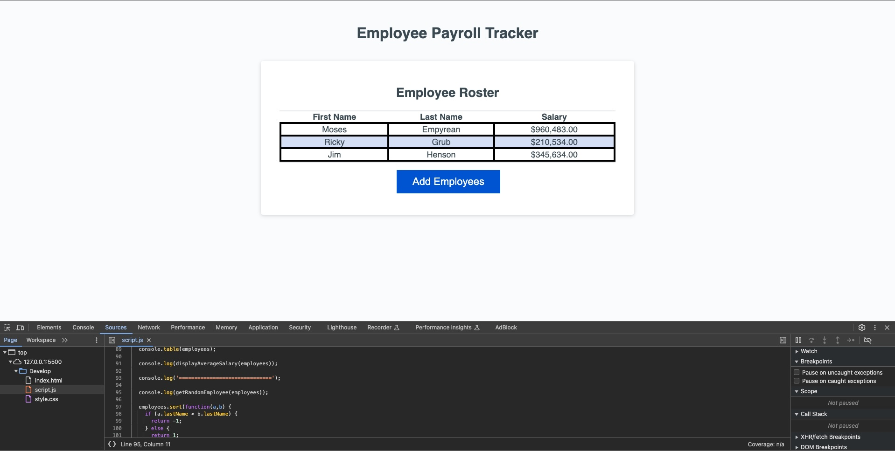

# refactored-employee-payroll-tracker

# Description

This application enables a payroll manager to view and manage employee payroll data. This app runs in the browser and features dynamically updated HTML and CSS powered by JavaScript code. It has a clean, polished, responsive user interface that adapts to multiple screen sizes. The payroll manager can click the "Add Employees" button and enter payroll data through several prompts. After adding an employee's data, the app asks if they would like to add another, and they can choose to continue to add more employees or cancel. When they continue, the same series of prompts will be displayed. When they cancel, the application displays the employee's data on the page sorted alphabetically by last name, and the console shows computed and aggregated data, including the average salary and a random drawing winner. In this project, I learned how to write efficient and executable javaScript functions using while loops, for loops, conditionals, and various variables and primitives. 

## Screenshot

## Credits 

Patrick Hennessy - https://github.com/RickHennessey87

## License

MIT License

Copyright (c) 2024 RickHennessey87

Permission is hereby granted, free of charge, to any person obtaining a copy
of this software and associated documentation files (the "Software"), to deal
in the Software without restriction, including without limitation the rights
to use, copy, modify, merge, publish, distribute, sublicense, and/or sell
copies of the Software, and to permit persons to whom the Software is
furnished to do so, subject to the following conditions:

The above copyright notice and this permission notice shall be included in all
copies or substantial portions of the Software.

THE SOFTWARE IS PROVIDED "AS IS", WITHOUT WARRANTY OF ANY KIND, EXPRESS OR
IMPLIED, INCLUDING BUT NOT LIMITED TO THE WARRANTIES OF MERCHANTABILITY,
FITNESS FOR A PARTICULAR PURPOSE AND NONINFRINGEMENT. IN NO EVENT SHALL THE
AUTHORS OR COPYRIGHT HOLDERS BE LIABLE FOR ANY CLAIM, DAMAGES OR OTHER
LIABILITY, WHETHER IN AN ACTION OF CONTRACT, TORT OR OTHERWISE, ARISING FROM,
OUT OF OR IN CONNECTION WITH THE SOFTWARE OR THE USE OR OTHER DEALINGS IN THE
SOFTWARE.

## Resources

https://www.w3schools.com/

https://developer.mozilla.org/